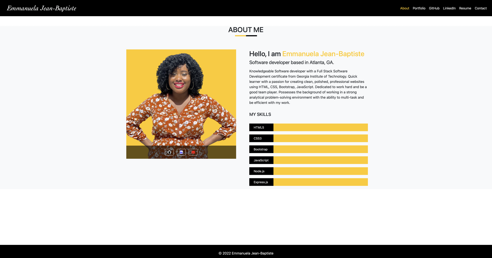

# My Portfolio

### Weclome to My Porfolio Page.

### My website has about me which tell you a little about myself and my profolio page list my work. my website also contains links to my Github, linkedIn and Resume.

### Tecnology used:

### my webpage was created with html, bootstrap and css.

Link to website:
https://emma4jesus.github.io/myportfolio/

GitHub Repo: https://github.com/emma4jesus/myportfolio

# Srceenshot

## About Page

## Portfolio page

